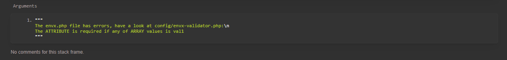
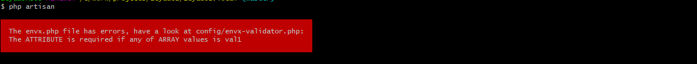

Laravel Envx
======

Laravel Envx is a custom php environment file as an array so that it can have associative and multidimensional arrays with validation rules in order to avoid any unexpected behaviour especially if there are several instances of the project. 
This has been tested with laravel `5.6` and `5.7`.

## Highlights

- Make sure you don't go live without all required envx.php variables and without the correct values
- Validate envx.php variables using the Laravel Validator by defining rules in config/envx-validator.php
- Custom validation rule `required_ifany` to apply rules to an atrribute if another array attribute has a given value

## Usage

Just like laravel env => `envx('attribute', 'default')`

## Installation

Via Composer:

``` bash
    composer require zeyad82/laravel-envx
```

If you don't use auto-discovery, add the service provider your `config/app.php`:

``` php
    Zeyad82\LaravelEnvx\LaravelEnvxServiceProvider::class,
```

#### Publish configuration file

``` bash
    php artisan vendor:publish --tag="laravel-envx"
```

This will publish `config/envx-validator.php` and `envx.example.php` then run 

``` bash
    cp envx.example.php envx.php
```
If you will have different envx.php, add `envx.php` to `.gitignore` in your project root


If you will use envx in config files, the only way I found is to append the follwing to `bootstrap/app.php` after `ExceptionHandler`
``` php

$app->singleton('envx', function ($app) {
    return new Zeyad82\LaravelEnvx\EnvxService;
});

```
### Example configuration file
``` php
<?php
// config/envx-validator.php

return [
    'ARRAY'         => 'required|array',
    'ARRAY.*'       => 'required|in:val1,val2,val3',

    'ATTRIBUTE'     => 'required_ifany:ARRAY,val1|url',
]

```

### Example envx.php file
``` php
<?php

return [
    'ARRAY'                     => 'required|array',
    'ARRAY.*'                   => 'required|in:val1,val2,val3',

    'ATTRIBUTE'                 => 'required_ifany:ARRAY,val1|url',
];

```

## Screenshot

### Command Line


### Browser



## Security

If you discover any security related issues, please email zeyad82@yahoo.com instead of using the issue tracker.

## Credits

- [Zeyad Mounir](https://github.com/zeyad82)

## License

The MIT License (MIT). Please see [License](LICENSE) for more information.
